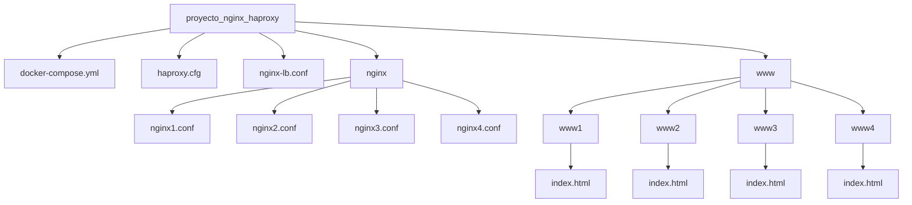

Este proyecto implementa un cluster de servidores web Nginx balanceados por HAProxy, con un servidor Nginx adicional que actúa como balanceador de carga para las instancias de HAProxy. 

## Estructura del Proyecto

```
proyecto_nginx_haproxy/
│
├── docker-compose.yml
├── haproxy.cfg
├── nginx-lb.conf
├── nginx/
│   ├── nginx1.conf
│   ├── nginx2.conf
│   ├── nginx3.conf
│   └── nginx4.conf
└── www/
    ├── www1/
    │   └── index.html
    ├── www2/
    │   └── index.html
    ├── www3/
    │   └── index.html
    └── www4/
        └── index.html
```



## Componentes

- **Nginx Load Balancer**: Distribuye el tráfico entre las instancias de HAProxy.
- **HAProxy**: Dos instancias que actúan como balanceadores de carga para los servidores Nginx.
- **Nginx Servers**: Cuatro servidores web Nginx que sirven contenido estático.

## Flujo de Tráfico

1. Las solicitudes llegan al Nginx Load Balancer.
2. El Nginx Load Balancer distribuye el tráfico entre las dos instancias de HAProxy.
3. Cada instancia de HAProxy balancea la carga entre los cuatro servidores Nginx.
4. Los servidores Nginx sirven el contenido estático.

## Requisitos Previos

- Docker
- Docker Compose

## Instalación y Uso

1. Clonar el repositorio:
   ```
   git clone https://github.com/frbadillo/proyecto_nginx_haproxy.git
   cd proyecto_nginx_haproxy
   ```

2. Iniciar los contenedores:
   ```
   docker-compose up -d
   ```

3. Acceder a la aplicación:
   Abrir un navegador y visitar `http://localhost`. Deberían verse páginas con diferentes colores de fondo rotando, demostrando el balanceo de carga.

4. Para detener los contenedores:
   ```
   docker-compose down
   ```

## Configuración

- `docker-compose.yml`: Define los servicios, redes y volúmenes para Docker Compose.
- `haproxy.cfg`: Configuración de HAProxy.
- `nginx-lb.conf`: Configuración del balanceador de carga Nginx principal.
- `nginx/*.conf`: Configuraciones individuales para cada servidor Nginx backend.
- `www/*/index.html`: Páginas HTML únicas para cada servidor Nginx backend.

## Demostración del Balanceo de Carga

Cada servidor Nginx backend sirve una página HTML con un color de fondo diferente:
Al recargar la página `http://localhost`, deberían verse estos colores alternándose, demostrando así que las solicitudes están siendo distribuidas entre los diferentes servidores.

## Monitoreo

- Estadísticas de HAProxy: 
  - HAProxy 1: `http://localhost:8404`
  - HAProxy 2: `http://localhost:8405`

## Escalabilidad

Para añadir más servidores Nginx backend:
1. Añadir nuevas configuraciones en el directorio `nginx/`.
2. Crear nuevos directorios en `www/` con los archivos index.html correspondientes.
3. Actualizar `docker-compose.yml` para incluir los nuevos servicios.
4. Actualizar `haproxy.cfg` para incluir los nuevos backends.

Para añadir más instancias de HAProxy:
1. Actualizar `docker-compose.yml` para incluir los nuevos servicios HAProxy.
2. Actualizar `nginx-lb.conf` para incluir a las nuevas instancias de HAProxy en la configuración de upstream.
